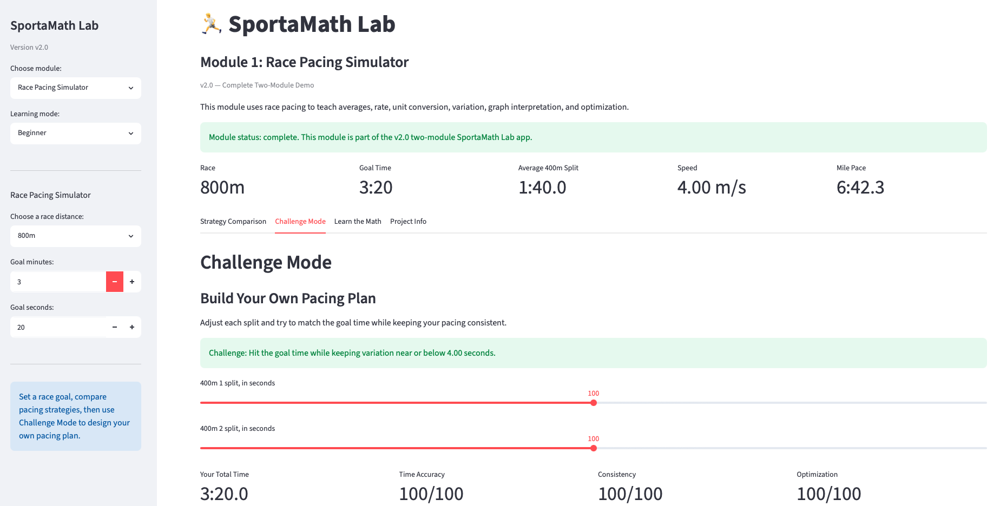
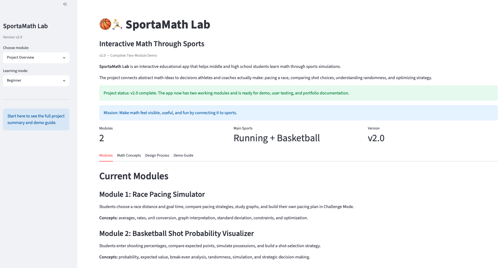

# SportaMath Lab

SportaMath Lab is an interactive educational app that teaches math through sports simulations.

The project helps middle and high school students understand abstract math concepts by connecting them to real sports decisions, including race pacing, basketball shot selection, probability, expected value, simulation, and optimization.

## Current Version

**v2.0 — Complete Two-Module Demo**

## Project Mission

SportaMath Lab exists because sports can make abstract math feel visible, useful, and fun for students who learn best through real situations, interactive simulations, and clear explanations.

## Screenshots

### Project Overview


### Race Pacing Simulator



### Basketball Shot Probability Visualizer



## Modules

## 1. Race Pacing Simulator

The Race Pacing Simulator lets students choose a race distance and goal time, compare pacing strategies, analyze graphs, and build their own pacing plan in Challenge Mode.

Students can compare:

- Even pacing
- Fast-start pacing
- Negative-split pacing
- Custom pacing plans

### Math Concepts

- Average
- Rate
- Unit conversion
- Graph interpretation
- Standard deviation
- Consistency
- Optimization under constraints

### What Students Learn

Students learn that two runners can finish with the same total time while using very different pacing strategies. The module helps students see why averages are useful but incomplete, and why variation matters when analyzing performance.

## 2. Basketball Shot Probability Visualizer

The Basketball Shot Probability Visualizer lets students compare 2-point and 3-point shots using shooting percentages, expected points, simulation, and strategy design.

Students can:

- Change 2-point and 3-point shooting percentages
- Compare expected points per shot
- Calculate the break-even 3-point percentage
- Simulate many possessions
- Build a mixed shot-selection strategy in Challenge Mode

### Math Concepts

- Probability
- Expected value
- Break-even analysis
- Randomness
- Simulation
- Strategy comparison
- Decision-making under uncertainty

### What Students Learn

Students learn that the best shot is not always the highest-value shot. A 3-point shot is worth more points, but it may have a lower chance of going in. Expected value helps compare these tradeoffs mathematically.

## Why I Built This

I built SportaMath Lab because sports can make math feel more connected to real life. Many students understand ideas better when they can adjust variables, see outcomes, and connect formulas to familiar situations.

As a student-athlete interested in math, engineering, and sports analytics, I wanted to build something that combined technical modeling with education. SportaMath Lab uses interactive simulations to make mathematical thinking more approachable and engaging.

## Tools Used

- Python
- Streamlit
- pandas
- NumPy
- Matplotlib

## How to Run the App

First, install the required Python packages:

```bash
python3 -m pip install streamlit pandas numpy matplotlib
```

Then run the app from the project folder:

```bash
cd ~/Desktop/sportamath-lab
python3 -m streamlit run app.py
```

## Project Structure

```text
sportamath-lab
├── app.py
├── README.md
└── screenshots
    ├── project-overview.png
    ├── race-challenge-mode.png
    └── basketball-challenge-mode.png
```

## Current Limitations

This app uses simplified models.

The race module does not include:

- Fatigue
- Hills
- Weather
- Terrain
- Biomechanics
- Race tactics

The basketball module does not include:

- Defense
- Fouls
- Free throws
- Rebounds
- Turnovers
- Player fatigue
- Game situation

These limitations are intentional for the current version because the app is designed to isolate core math concepts clearly.

## Future Improvements

Possible future improvements include:

- Adding more sports modules
- Adding real sports datasets
- Improving the visual design
- Adding user testing feedback
- Creating lesson plans for teachers or students
- Adding more advanced statistics
- Adding more advanced optimization features
- Expanding the basketball model to include fouls, rebounds, and turnovers
- Expanding the running model to include hills, fatigue, or weather

## Portfolio Summary

Built SportaMath Lab, a Python/Streamlit educational app that teaches math through interactive running and basketball simulations, including pacing optimization, expected value, probability-based strategy, and simulation-based learning.
